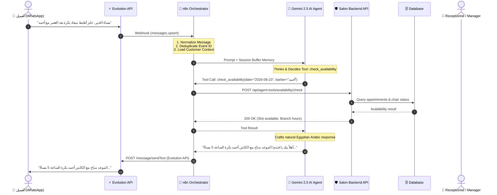
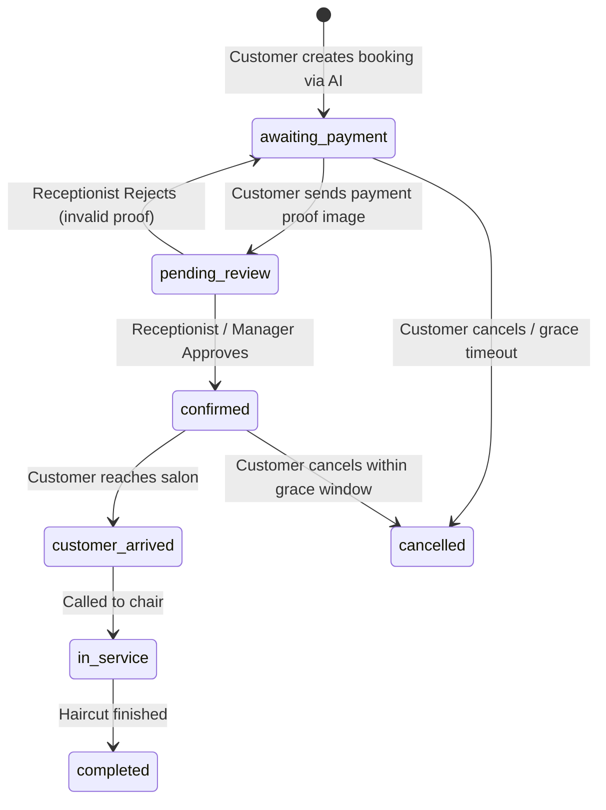

# WhatsApp AI Assistant & Booking Agent Architecture

## 1. Executive Summary

This architecture integrates a conversational WhatsApp AI Assistant into the existing **TrimMind (Elite Salon Platform)**. 

The system leverages:
- **Evolution API** as the WhatsApp transport gateway.
- **n8n** as the workflow orchestrator and state coordinator.
- **Google Gemini (Gemini 2.5 / Flash)** as the cognitive intelligence and natural language reasoner.
- **Existing Backend REST API & Database** as the authoritative single source of truth and business logic enforcer.

---

## 2. End-to-End System Architecture

---

## 3. Core Principles & Design Rules

1. **No Keyword Bots / State Machines**: 
   The system does NOT use rigid regex/keyword routers (`"حجز"` -> static branch). Gemini understands free-form text, slang, missing details, and context.
2. **Backend is the Sole Truth**:
   The AI agent never accesses SQL directly and never alters DB tables without passing through backend validators and authorization checks.
3. **Deterministic Financial Safety**:
   The AI agent CANNOT mark payments as confirmed or approved. Incoming payment receipts automatically transition bookings to `pending_review`, where a human receptionist reviews and approves them.
4. **Idempotency & Deduplication**:
   Every incoming event uses the WhatsApp Message ID (`key.id`) and phone timestamp to prevent double-booking or duplicate messages.

---

## 4. Booking Lifecycle State Machine

---

## 5. Security & Isolation

- **Endpoint Security**: `/api/agent-tools/*` is protected via `x-agent-secret` / `AGENT_API_SECRET`.
- **Identity Isolation**: Phone ownership is verified before any booking cancellation or modification.
- **Prompt Injection Immunity**: System prompt explicitly instructs the model to ignore system prompt leak requests, database dumps, and role modifications.
